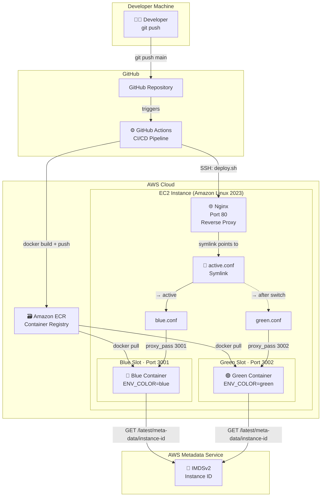
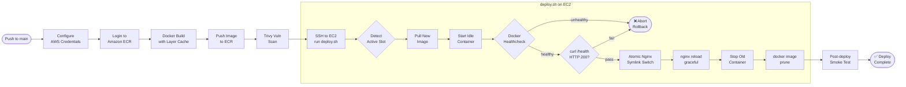
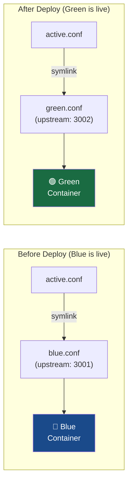

# ⬡ Blue-Green Zero-Downtime Deployment System

<div align="center">


**A production-grade, zero-downtime deployment system using the Blue-Green pattern — hosted on AWS EC2, containerised with Docker, switched atomically by Nginx, and automated end-to-end with GitHub Actions.**

[Features](#-features) · [Architecture](#-architecture) · [Setup Guide](#-setup-guide) · [How It Works](#-how-it-works) · [Endpoints](#-api-endpoints)

</div>

---

## 🎯 What This Solves

Traditional deployments require a maintenance window — the server goes down, the new version goes up, users see an error page. This system eliminates that window entirely by:

1. **Running two identical environments** (Blue and Green) simultaneously
2. **Deploying new code to the idle environment** while live traffic flows uninterrupted
3. **Health-checking the new environment** before touching any live traffic
4. **Switching traffic atomically** with an Nginx symlink (sub-millisecond) only after a passing health check
5. **Automatically rolling back** if health checks fail — the old environment is never stopped until the new one is verified

---

## ✨ Features

| Category | Detail |
|---|---|
| 🔄 Zero Downtime | Nginx atomic symlink switch — no dropped connections |
| 🩺 Health Gates | Docker HEALTHCHECK + curl `/health` probe before any traffic switch |
| 🐳 Containerised | Multi-stage Docker build; non-root user; `dumb-init` PID 1 |
| 🔐 Secure by Default | IMDSv2, least-privilege IAM, no hardcoded credentials |
| 📦 ECR Integration | Layer caching, automatic `latest` tag, Trivy vulnerability scan |
| 🤖 Fully Automated | Push to `main` → build → deploy → verify → switch → cleanup |
| 📊 Live Dashboard | Real-time metrics: environment, version, instance ID, memory, load |
| 🧹 Auto-Cleanup | Docker image prune after every deploy (saves disk space) |
| 🔁 Idempotent | Re-running deploy on same commit is safe |
| 📋 Audit Trail | GitHub Step Summary with full deployment metadata |

---

## 🏗 Architecture

### System Overview



### CI/CD Pipeline Flow



### Nginx Symlink Mechanism



---

## 📁 Project Structure

```
blue-green-deployment/
├── .github/
│   └── workflows/
│       └── main.yml          # GitHub Actions CI/CD pipeline
│
├── app/
│   ├── src/
│   │   └── index.js          # Express app (dashboard, /health, /load)
│   ├── public/
│   │   ├── index.html        # Dashboard UI
│   │   └── style.css         # Styling + blue/green CSS theming
│   └── package.json
│
├── nginx/
│   ├── nginx.conf            # Main Nginx config (hardened)
│   ├── blue.conf             # Blue slot – upstream: 127.0.0.1:3001
│   └── green.conf            # Green slot – upstream: 127.0.0.1:3002
│
├── Dockerfile                # Multi-stage, non-root, dumb-init
├── docker-compose.yml        # Blue + Green service definitions
├── deploy.sh                 # Blue-green switch logic (runs on EC2)
├── bootstrap.sh              # One-time EC2 setup script
└── README.md
```

---

## 🚀 Setup Guide

### Prerequisites

- AWS Account with permissions: `ecr:*`, `ec2:*`
- GitHub repository with Actions enabled
- A domain name or EC2 public IP

---

### Step 1 – Create an IAM User (Least Privilege)

In the AWS Console → IAM → Users → **Create User**:

**Policy (inline JSON):**
```json
{
  "Version": "2012-10-17",
  "Statement": [
    {
      "Sid": "ECRAccess",
      "Effect": "Allow",
      "Action": [
        "ecr:GetAuthorizationToken",
        "ecr:BatchCheckLayerAvailability",
        "ecr:GetDownloadUrlForLayer",
        "ecr:BatchGetImage",
        "ecr:InitiateLayerUpload",
        "ecr:UploadLayerPart",
        "ecr:CompleteLayerUpload",
        "ecr:PutImage",
        "ecr:DescribeRepositories",
        "ecr:CreateRepository"
      ],
      "Resource": "*"
    }
  ]
}
```

Save the **Access Key ID** and **Secret Access Key**.

---

### Step 2 – Create an ECR Repository

```bash
# Via AWS CLI
aws ecr create-repository \
  --repository-name bg-deploy-app \
  --region us-east-1 \
  --image-scanning-configuration scanOnPush=true \
  --encryption-configuration encryptionType=AES256
```

Or in the AWS Console → ECR → **Create Repository**.

---

### Step 3 – Launch an EC2 Instance

**AWS Console → EC2 → Launch Instance:**

| Setting | Value |
|---|---|
| AMI | Amazon Linux 2023 (latest) |
| Instance Type | t3.small (minimum for Docker) |
| Key Pair | Create or use existing `.pem` |
| Security Group | Inbound: TCP 80 (0.0.0.0/0), TCP 22 (your IP only) |
| IAM Role | Attach role with `AmazonEC2ReadOnlyAccess` (for IMDSv2) |
| Storage | 20 GB gp3 |

**Enable IMDSv2** (Instance Metadata Service v2):
```bash
# After launch, enforce IMDSv2 on the instance
aws ec2 modify-instance-metadata-options \
  --instance-id i-xxxxxxxxxx \
  --http-tokens required \
  --http-endpoint enabled
```

---

### Step 4 – Bootstrap the EC2 Instance

```bash
# Copy project to EC2
scp -i your-key.pem -r . ec2-user@<EC2-IP>:~/blue-green-deployment/

# SSH in and run the bootstrap script
ssh -i your-key.pem ec2-user@<EC2-IP>
cd ~/blue-green-deployment
sudo bash bootstrap.sh
```

The bootstrap script will:
- Install Docker, Docker Compose v2, Nginx, AWS CLI v2
- Configure the ECR credential helper
- Install Nginx config files and create the initial `active.conf → blue.conf` symlink
- Start and enable all services

---

### Step 5 – Configure GitHub Secrets

In your GitHub repository → **Settings → Secrets and Variables → Actions → New repository secret**:

| Secret Name | Value |
|---|---|
| `AWS_ACCESS_KEY_ID` | IAM user access key |
| `AWS_SECRET_ACCESS_KEY` | IAM user secret key |
| `AWS_REGION` | `us-east-1` (or your region) |
| `AWS_ACCOUNT_ID` | 12-digit AWS account ID |
| `ECR_REPO` | `bg-deploy-app` |
| `EC2_HOST` | Public IP or DNS of EC2 instance |
| `EC2_USER` | `ec2-user` |
| `EC2_SSH_KEY` | Contents of your `.pem` file (multi-line) |

---

### Step 6 – Deploy!

```bash
git add .
git commit -m "feat: initial deployment"
git push origin main
```

Watch the pipeline in **GitHub → Actions → Blue-Green Deploy**.

Visit `http://<EC2-IP>` to see the live dashboard.

---

## 🔁 How It Works

### The Atomic Switch

The key to zero downtime is Nginx's ability to reload its config gracefully — it finishes serving all in-flight requests before applying the new config. We exploit this with a symlink:

```bash
# Atomic symlink replacement (POSIX-atomic: no race condition)
ln -sfn /etc/nginx/conf.d/green.conf /etc/nginx/conf.d/active.conf.tmp
mv -f /etc/nginx/conf.d/active.conf.tmp /etc/nginx/conf.d/active.conf
nginx -t && systemctl reload nginx
```

- `ln + mv` is atomic at the filesystem level — no moment where `active.conf` is missing
- `nginx -t` validates the new config before reloading — safe against syntax errors
- `systemctl reload nginx` sends `SIGHUP` — zero dropped connections

### Health Check Gates

Before traffic is switched, **two independent checks** must pass:

1. **Docker HEALTHCHECK** — verifies the container process itself is healthy
2. **curl /health** — an HTTP-level probe that also validates the correct `ENV_COLOR` is running

If either fails, `deploy.sh` aborts with `exit 1`, GitHub Actions marks the step as failed, and the symlink is **never touched** — live traffic continues flowing to the old slot.

---

## 🌐 API Endpoints

| Endpoint | Method | Description |
|---|---|---|
| `/` | GET | Live system dashboard (HTML) |
| `/api/info` | GET | JSON: env, version, instanceId, metrics |
| `/health` | GET | Health probe – returns `{"status":"healthy"}` |
| `/load?duration=N` | GET | CPU stress test for N seconds (max 30) |

---

## 🔐 Security Notes

- **IMDSv2 Only** — Instance metadata fetched with required token (PUT + GET)
- **Non-root Container** — App runs as `appuser:appgroup` inside Docker
- **Least-Privilege IAM** — CI user has only ECR permissions needed
- **No Secrets in Code** — All credentials via GitHub Secrets → environment variables
- **dumb-init PID 1** — Proper signal forwarding; prevents zombie processes
- **Server Tokens Off** — Nginx version hidden (`server_tokens off`)

---

## 🛠 Troubleshooting

**Nginx won't reload after symlink switch:**
```bash
nginx -t  # Check config syntax
cat /var/log/nginx/error.log | tail -20
```

**Container stuck in "starting" health status:**
```bash
docker inspect bg-green | jq '.[0].State.Health'
docker logs bg-green --tail 50
```

**ECR pull failing on EC2:**
```bash
# Ensure credential helper is configured
cat ~/.docker/config.json
# Re-login manually to test
aws ecr get-login-password --region us-east-1 | docker login --username AWS --password-stdin <ACCOUNT>.dkr.ecr.us-east-1.amazonaws.com
```

**Check active slot:**
```bash
readlink -f /etc/nginx/conf.d/active.conf
# Should output: /etc/nginx/conf.d/blue.conf  or  /etc/nginx/conf.d/green.conf
```

---

## 📄 License

MIT © 2024 — Built for portfolio demonstration of production DevOps practices.
